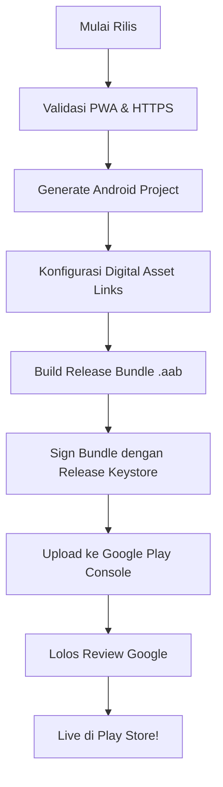

# Roadmap Deploy Android APK - WIBAWA NUSANTARA

Dokumen ini menjelaskan strategi pembungkusan (wrapping) aplikasi web PWA **WIBAWA NUSANTARA** menjadi aplikasi Android (.APK / .AAB) untuk dideploy ke Google Play Store.

---

## 🛠️ Opsi Arsitektur Pembungkus

Kami menyarankan dua opsi utama yang dapat digunakan tergantung pada tingkat integrasi fitur native yang diperlukan di masa depan.

### OOPSI 1: Trusted Web Activity (TWA) via Bubblewrap (Rekomendasi Awal)
Trusted Web Activity (TWA) adalah cara termudah dan teringan untuk mempublikasikan PWA Next.js yang sudah stabil ke Play Store. 
* **Bagaimana Cara Kerjanya**: Google Play mengunduh APK ringan yang membuka instansi browser Chrome layar penuh yang aman tanpa bar alamat (standalone PWA).
* **Kelebihan**:
  - Ukuran file APK sangat kecil (< 3MB).
  - Menggunakan rendering Engine Chrome terbaru di HP user (selalu up-to-date).
  - Sinkronisasi instan: Setiap kali ada perubahan di server web, aplikasi di HP user langsung terupdate tanpa perlu upload ulang ke Play Store.
* **Kekurangan**: Terbatas pada fitur web standar (tidak bisa menulis custom Java/Kotlin native plugins).

### OOPSI 2: Capacitor (Native Container)
Capacitor oleh Ionic adalah runtime modern yang membungkus web app Next.js ke dalam aplikasi native Web View yang lebih terkontrol.
* **Bagaimana Cara Kerjanya**: Aset statis Next.js diekspor (`next export`) dan dikompilasi secara lokal ke dalam folder `/android` proyek Android Studio.
* **Kelebihan**:
  - Akses penuh ke API native Android (Bluetooth, Biometrik, Kontak, Peta Native).
  - Kontrol mendalam atas splash screen, status bar, dan push notification tingkat hardware.
* **Kekurangan**:
  - Memerlukan ekspor Next.js statis, yang berarti dynamic SSR route harus disesuaikan ke client-side fetch.
  - Setiap perubahan kode mewajibkan kompilasi ulang dan rilis update di Play Store console.

---

## 📋 Checklist Persiapan Rilis Google Play (Sebelum APK)

Sebelum menjalankan command kompilasi APK, pastikan kriteria berikut terpenuhi di server web PWA:

### 1. Validasi PWA & Service Worker
- [ ] Manifest file `/manifest.webmanifest` valid tanpa error di Chrome DevTools Application tab.
- [ ] Service worker `sw.js` aktif dan melayani offline fallback dengan benar.
- [ ] Icons maskable berukuran `192x192` dan `512x512` beresolusi tinggi tersedia.

### 2. Keamanan & Kepercayaan (Digital Asset Links)
Untuk TWA, alamat web harus diverifikasi secara resmi oleh Google Play menggunakan protokol **Digital Asset Links**:
- [ ] Buat file verification di: `https://wibawa-nusantara-domain.com/.well-known/assetlinks.json`
- [ ] File tersebut harus berisi tanda tangan SHA-256 dari kunci rilis (keystore) Android Anda. Ini menghilangkan bar alamat Chrome di dalam aplikasi HP.

### 3. Halaman Wajib Kebijakan Privasi (Privacy Policy)
- [ ] Sediakan link statis yang dapat diakses publik, contoh: `/privacy-policy`
- [ ] Link ini wajib dicantumkan dalam Google Play Console saat pendaftaran.

### 4. Akun Google Play Console
- [ ] Akun Developer Google Play aktif ($25 one-time registration fee).
- [ ] Nama paket (Package Name) unik disiapkan, contoh: `com.wibawanusantara.app`.

---

## 🚀 Alur Rilis Produksi (Production Run)

